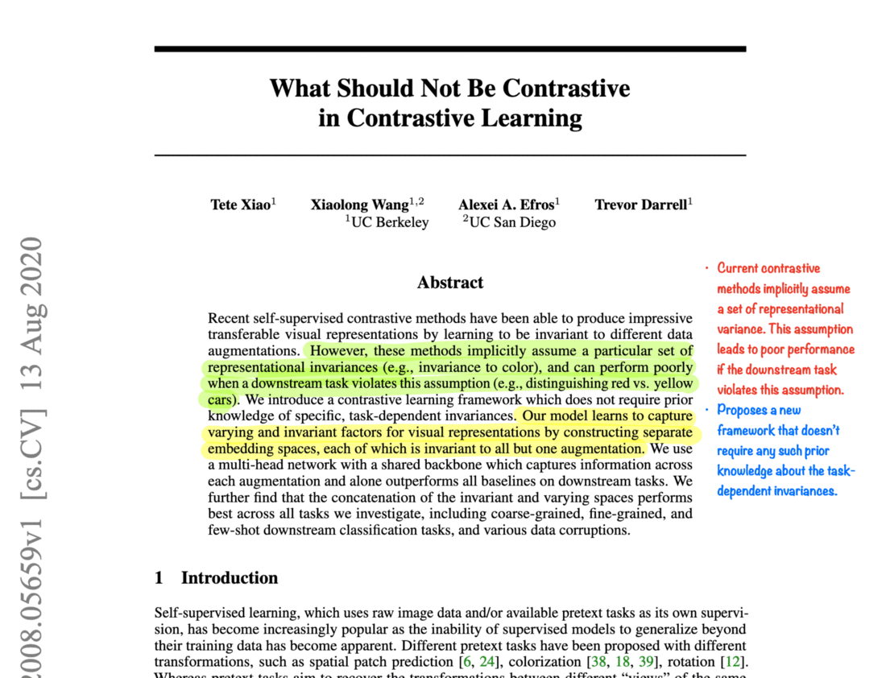

# Annotate Research Papers

## Why annotated papers?

Do you love reading research papers? Or do you find reading papers intimidating? Or are you looking for annotated research papers that are much easier to understand?

If you are in any of the categories listed above, then you have arrived at the right place.  I spend a lot of time reading papers. It is a crucial part of my ML work. If you want to do research or you want to be a better ML engineer, then you should read papers. This habit of reading papers will help you to remain updated with the field. 
 
**Note:** I am a pen-paper guy. Nothing beats that pen-paper reading experience, but in the ongoing scenarios (pandemic, lockdown, etc.), I am not able to print the papers. Taking this as an opportunity to share my thought process, I will be sharing the annotated research papers in this repo. 
**The order of the papers won't strictly be according to the timeline on arXiv. Sometimes I put a paper on hold and read it after a while.**

**PS:** I cannot annotate all the papers I read, but if I liked one, then that will be uploaded here. Also, there will be blog posts for a few research papers that are really important.

# Table of Contents

| Field           | Category        | Annotated Paper                                                                                                                                |                                                                          |                                             |
|:----------------|:----------------|:--------------------------------------------------------------------------------------------------------------------------------------------------|:------------------------------------------------------------------------------|:--------------------------------------------------------|
| Computer Vision |                 | [Adaptive Risk Minimization](./meta-learning/adaptive_risk_minimization.pdf)                                                                      |                                                                               | [Abstract](https://openreview.net/forum?id=MA8eT-vUPvZ) |
|                 |                 | [Axial DeepLab](./segmentation/axial_deeplab.pdf)                                                                                                 | [Code](https://github.com/google-research/deeplab2)                           | [Abstract](https://arxiv.org/abs/2003.07853v2)          |
|                 |                 | [ConvNext](./supervised/convnexts.pdf)                                                                                                            | [Code](https://github.com/facebookresearch/ConvNeXt)                          | [Abstract](https://arxiv.org/abs/2201.03545v1)          |
|                 |                 | [EfficientNetsV2](./supervised/efficientnet_v2.pdf)                                                                                               | [Code](https://github.com/google/automl/tree/master/efficientnetv2)           | [Abstract](https://arxiv.org/abs/2104.00298v3)          |
|                 | Supervised      | [Flow-edge Guided Video Completion](./supervised/flowedge_guided_video_completion.pdf)                                                            | [Code](https://github.com/vt-vl-lab/FGVC)                                     | [Abstract](https://arxiv.org/abs/2009.01835v1)          |
|                 |                 | [Is Batch Norm Unique?](./supervised/is_batch_norm_unique.pdf)                                                                                    |                                                                               | [Abstract](https://arxiv.org/abs/2010.10687v1)|         |
|                 |                 | [Knowledge Distillation: A good teacher is patient and consistent](./supervised/knowledge_distillation.pdf)                                                                                                            | [Code](https://github.com/google-research/big_vision)                                | [Abstract](https://arxiv.org/abs/2106.05237)          |
|                 |                 | [RandConv](./supervised/rand_conv.pdf)                                                                                                            | [Code](https://github.com/wildphoton/RandConv)                                | [Abstract](https://arxiv.org/abs/2007.13003v3)          |
|                 |                 | [Polyloss](./supervised/polyloss.pdf)                                                                                                            | [Code](https://github.com/tensorflow/tpu/tree/master/models/official/)                                | [Abstract](https://arxiv.org/abs/2204.12511)          |
|                 |                 | [Scaling Down Deep Learning](./supervised/scaling_down_deeplearning.pdf)                                                                          | [Code](https://github.com/greydanus/mnist1d)                                  | [Abstract](https://arxiv.org/abs/2011.14439v3)          |
|                 |                 | [Segment Anything](./segmentation/segment_anything.pdf)                                                                          |                                  | [Abstract](https://arxiv.org/abs/2304.02643)          |
|                 |                 | [Supervised Contrastive Learning](./supervised/supervised_contrastive_learning.pdf)                                                               | [Code](https://github.com/google-research/google-research/tree/master/supcon) | [Abstract](https://arxiv.org/abs/2004.11362v5)          |
|                 |                 | [Vision Transformer](./supervised/an_image_is_worth_16x16_words_transformers_for_image_recognition_at_scale.pdf)                                  | [Code](https://github.com/google-research/vision_transformer)                 | [Abstract](https://arxiv.org/abs/2010.11929)            |
|                 |                 |                                                                                                                                                   |                                                                               |                                                         |
|                 |                 |                                                                                                                                                   |                                                                               |                                                         |
|                 |                 | [Are all negatives created equal in contrastive instance discrimination?](./self-supervised-learning/are_all_negatives_created_equal_for_CID.pdf) |                                                                               | [Abstract](https://arxiv.org/abs/2010.06682v2)          |
|                 |                 | [Towards Domain-Agnostic Contrastive Learning](./self-supervised-learning/domain_agnostic_contrastive_learning.pdf)                               |                                                                               | [Abstract](https://arxiv.org/abs/2011.04419v2)          |
|                 | Self-Supervised | [Emerging Properties in Self-Supervised Vision Transformers](self-supervised-learning/emerging_properties_in_self_supervised_vit.pdf)             | [Code](https://github.com/facebookresearch/dino)                              | [Abstract](https://arxiv.org/abs/2104.14294v2)          |
|                 |                 | [Masked Autoencoders ](./self-supervised-learning/masked_autoencoder.pdf)                                                                         | [Code](https://github.com/facebookresearch/mae)                               | [Abstract](https://arxiv.org/abs/2111.06377v2)          |
|                 |                 | [Swav](./self-supervised-learning/swav.pdf)                                                                                                       | [Code](https://github.com/facebookresearch/swav)                              | [Abstract](https://arxiv.org/abs/2006.09882v5)          |
|                 |                 | [What Should Not Be Contrastive in Contrastive Learning](./self-supervised-learning/what_should_not_be_contrastive_in_constrative_learning.pdf)   |                                                                               | [Abstract](https://arxiv.org/abs/2008.05659v2)          |
|                                     |                 |                                                                                                                                                   |                                                                               |                                                         |
|                                     |                 |                                                                                                                                                   |                                                                               |                                                         |
|                                     | Semi-Supervised | [CoMatch](./semi-supervised-learning/comatch.pdf)                                                                                                 | [Code](https://github.com/salesforce/CoMatch)                                 | [Abstract](https://arxiv.org/abs/2011.11183v2)          |
|                                     |                 |                                                                                                                                                   |                                                                               |                                                         |
|                                     |                 |                                                                                                                                                   |                                                                               |                                                         |
| Diffusion Models                    |                 | [Understanding Diffusion Models](./diffusion_models/understanding_diffusion_models.pdf) |  | [Abstract](https://arxiv.org/abs/2208.11970)          |
|                                     |                 | [On the Importance of Noise Scheduling for Diffusion Models](./diffusion_models/on_the_importance_of_noise_scheduling.pdf)                                                                                                                          |                                                                               | [Abstract](https://arxiv.org/abs/2301.10972)            |
|                                     |                 |                                                                                                                                                   |                                                                             |                                                        |
|                                     |                 |                                                                                                                                                   |                                                                             |                                                        |
| GANs                                |                 | [CycleGan](./gans/cycle_gan.pdf)                                                                                                                  | [Code](https://keras.io/examples/generative/cyclegan/)                        | [Abstract](https://arxiv.org/abs/1703.10593v7)          |
|                                     |                 |                                                                                                                                                   |                                                                               |                                                         |
|                                     |                 |                                                                                                                                                   |                                                                               |                                                         |
| Interpretability and Explainability |                 | [What is being transferred in transfer learning?](./interpretability_and_explainability/what_is_being_transferred_in_transfer_learning.pdf)       | [Code](https://github.com/google-research/understanding-transfer-learning)    | [Abstract](https://arxiv.org/abs/2008.11687v2)          |
|                                     |                 | [Explaining in Style](./interpretability_and_explainability/explaining_in_style.pdf)                                                              | [Code](https://github.com/google/explaining-in-style)                         | [Abstract](https://arxiv.org/abs/2104.13369v2)          |
|                                     |                 |                                                                                                                                                   |                                                                               |                                                         |
|                                     |                 |                                                                                                                                                   |                                                                               |                                                         |
| NLP                                 |                 | [Do Language Embeddings Capture Scales?](./NLP/do_language_embeddings_capture_scales.pdf)                                                         |                                                                               | [Abstract](https://arxiv.org/abs/2010.05345v3)          |
|                                     |                 | [mSLAM](./NLP/mSLAM.pdf)                                                                                                                          |                                                                               | [Abstract](https://arxiv.org/abs/2202.01374)            |
|                                     |                 | [Cramming](./NLP/cramming.pdf)                                                                                                                          |                                                                               | [Abstract](https://arxiv.org/abs/2212.14034)            |
|                                     |                 |                                                                                                                                                   |                                                                               |                                                         |
|                                     |                 |                                                                                                                                                   |                                                                               |                                                         |
| Speech                              |                 | [SpeechStew](./speech/speech_stew.pdf)                                                                                                            |                                                                               | [Abstract](https://arxiv.org/abs/2104.02133v3)          |
|                                     |                 | [mSLAM](./NLP/mSLAM.pdf)                                                                                                                          |                                                                               | [Abstract](https://arxiv.org/abs/2202.01374)            |
|                                     |                 | [WhisperX](./speech/whisperX.pdf)                                                                                                                          |                                      [Code](https://github.com/m-bain/whisperX)                                         | [Abstract](https://arxiv.org/abs/2303.00747)            |
|                                     |                 |                                                                                                                                                   |                                                                               |                                                         |
|                                     |                 |                                                                                                                                                   |                                                                               |                                                         |
| Others                              |                 | [Multi-Task Self-Training for Learning General Representations](./multi-task-learning/multi_task_self_training.pdf)                               |                                                                               | [Abstract](https://arxiv.org/abs/2108.11353v1)          |
|                              |                 | [Decoder Denoising Pretraining for Semantic Segmentation](./segmentation/decoder_denoising_pretraining.pdf)                               |                                                                               | [Abstract](https://arxiv.org/abs/2205.11423)          |                                     |

# Community Contributions

**Note:** The annotated papers in this section are contributed by the community. As I cannot verify the annotation for each paper, I will lay out certain guidelines for annotations so that every annotated paper has same sections at least